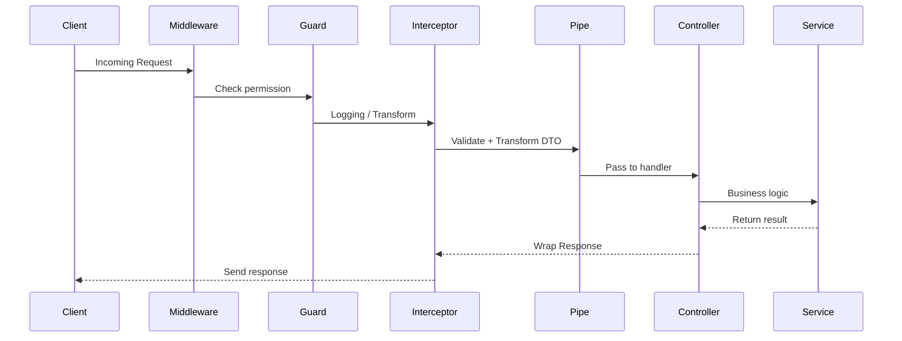

# 🔁 NestJS Life Cycle (เข้าใจง่าย + ใช้งานได้จริง)

NestJS มี **Life Cycle แบบ Framework** คือโครงสร้างการทำงานของระบบตั้งแต่เริ่มบูต → รับ request → ตอบ response

---

## 📦 1. Application Bootstrap Phase

เมื่อ `main.ts` เริ่มทำงาน NestJS จะ:

1. เรียก `NestFactory.create(AppModule)`
2. โหลดทุก Module → วิเคราะห์ Dependency Injection (DI)
3. รัน Hook ต่างๆ เช่น:
   - `onModuleInit()`
   - `onApplicationBootstrap()`
4. เปิด Port ด้วย `.listen(port)`

```ts
async function bootstrap() {
  const app = await NestFactory.create(AppModule);
  await app.listen(3000);
}
```

---

## 🔄 2. Dependency Injection & Module Resolution

- NestJS ใช้ IOC (Inversion of Control) เพื่อ inject class ที่เราต้องใช้
- ทำงานผ่าน `@Injectable()` และ `providers`

เช่น:
```ts
@Injectable()
export class BooksService {
  constructor(private readonly db: DatabaseService) {}
}
```

---

## 🧠 3. Request Life Cycle

ทุก Request ที่เข้ามา → จะผ่านกระบวนการนี้:

```
Client Request
   ↓
Global Middleware (if any)
   ↓
Guards (e.g. AuthGuard)
   ↓
Interceptors (pre-handler)
   ↓
Pipes (e.g. Validation)
   ↓
Controller Handler (e.g. findAll())
   ↓
Interceptors (post-handler)
   ↓
Response
```

---

## 💡 สรุป Flow



---

## 🪝 4. Lifecycle Hook (ภายใน Module/Service)

NestJS ให้เราสามารถ “Hook” เข้าไปในแต่ละช่วงชีวิตของ App:

| Hook                     | ทำงานเมื่อ                                    |
|--------------------------|-----------------------------------------------|
| `onModuleInit()`         | เมื่อ Module นี้ถูกสร้างเสร็จ                |
| `onApplicationBootstrap()` | เมื่อแอปบูตเสร็จสมบูรณ์                     |
| `onModuleDestroy()`      | ก่อน Module ถูกทำลาย (graceful shutdown)     |
| `onApplicationShutdown()` | ก่อน App ปิดทั้งหมด                          |

```ts
@Injectable()
export class BooksService implements OnModuleInit {
  onModuleInit() {
    console.log('📦 BooksService initialized!');
  }
}
```

---

## ⚙️ 5. Application Shutdown Lifecycle

- ใช้ `enableShutdownHooks()` เพื่อให้ NestJS เรียก `onApplicationShutdown()`
- ใช้สำหรับ cleanup เช่น: ปิด DB, ปิด Queue

```ts
async function bootstrap() {
  const app = await NestFactory.create(AppModule);
  app.enableShutdownHooks();
  await app.listen(3000);
}
```

```ts
@Injectable()
export class AppService implements OnApplicationShutdown {
  onApplicationShutdown(signal: string) {
    console.log(`App is shutting down with signal: ${signal}`);
  }
}
```

---

## 📚 Best Practice

- ใช้ `@Injectable()` สำหรับทุก Service
- ใช้ `@Module` เพื่อแยก Concern
- ใส่ Validation ใน Pipe
- ควบคุม Flow ด้วย Guard / Interceptor
- ใช้ Hook สำหรับ logging, cleanup, seed data

---

## ✅ TL;DR: NestJS Request Flow

```txt
Bootstrap → DI Container → Middleware → Guard → Interceptor → Pipe → Controller → Service → Response
```

---

📌 ใช้แนวคิดนี้ในการ debug, สร้าง feature ใหม่, หรือวาง architecture ของแอปใน production ได้เลยครับ!